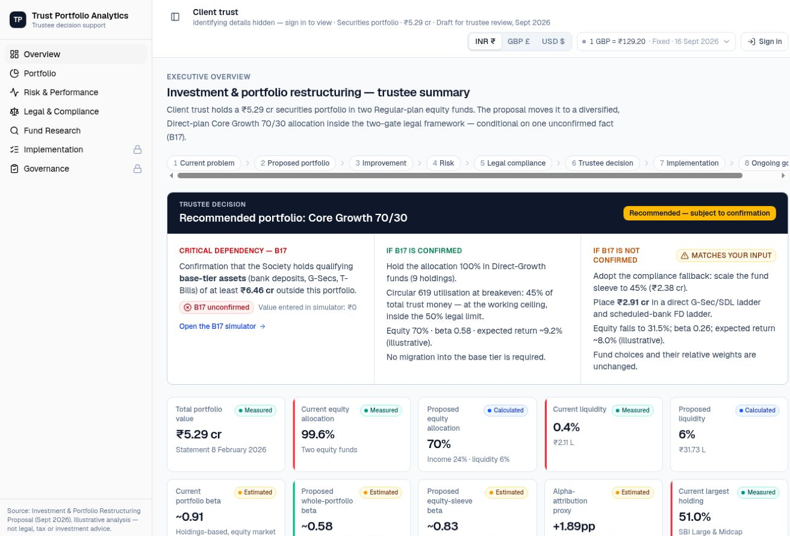
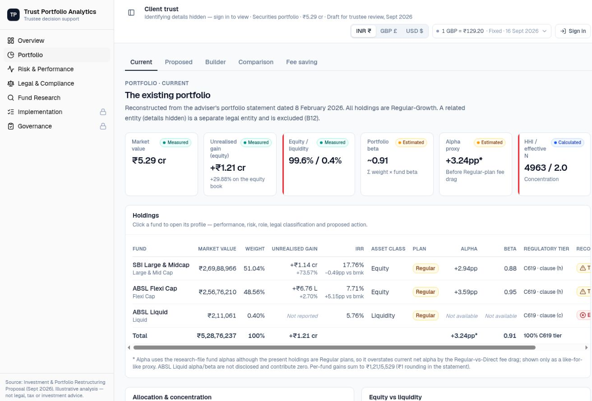
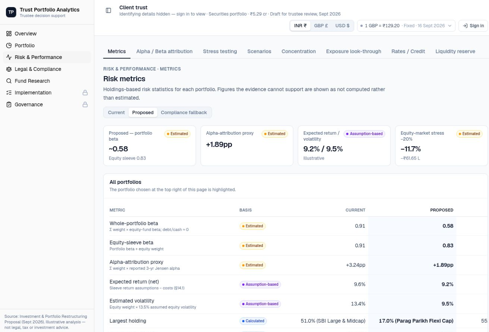
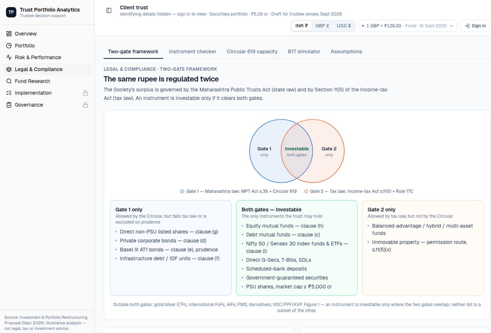

<div align="center">

# Trust Portfolio Analytics

**A trustee decision-support dashboard for analysing and restructuring a charitable trust’s investment portfolio.**

Turns a dense investment proposal into an interactive system for portfolio construction, risk analysis, legal compliance, implementation and ongoing governance.

[](https://nextjs.org/)
[](https://react.dev/)
[](https://tailwindcss.com/)
[](https://recharts.org/)
[](https://vercel.com/)

### [Open the live dashboard →](https://portfolio-dashboard-lftga62ur-ziyanrq.vercel.app/)

[Features](#what-it-does) · [Analytical approach](#being-honest-about-the-numbers) · [Architecture](#public-vs-authenticated) · [Run locally](#run-locally)

<sub>Public analytical view with authenticated implementation and governance areas.</sub>

</div>



<p align="center"><sub>The trustee overview brings the recommendation, key dependency, portfolio changes and compliance fallback into one decision screen.</sub></p>

---

## What it does

The underlying problem is not simply to “pick better funds”. A charitable trust’s portfolio has to satisfy investment, risk, liquidity and legal constraints at the same time. This dashboard makes those constraints visible and testable rather than hiding them inside a spreadsheet or report.

| Capability | What it provides |
|---|---|
| **Portfolio restructuring** | Reconstructs the current portfolio, models the proposed allocation and shows every retain, trim, exit and add decision. |
| **Risk analysis** | Compares beta, concentration, effective number of holdings, liquidity, credit exposure, stress tests and scenarios. |
| **Two-gate compliance** | Tests investments against both Maharashtra trust law and the Income-tax Act. |
| **Fund research** | Converts the candidate-fund research into role-based comparisons, profiles and substitution analysis. |
| **Implementation** | Turns the recommendation into a trade plan with shared statuses and progress tracking. |
| **Governance** | Records monitoring checks, assumptions, open items, trustee decisions and an append-only change history. |

The dashboard is built around one principle: **a number should say where it came from**. Important figures are labelled `Measured`, `Calculated`, `Estimated`, `Assumption-based` or `Unconfirmed`. If the evidence cannot support a figure, the interface shows **Not available** instead of inventing one.

## Product screens

<table>
<tr>
<td width="50%"><br><sub><b>Current portfolio</b> — holdings, gains, concentration, beta and alpha contribution.</sub></td>
<td width="50%"><br><sub><b>Risk & performance</b> — current, proposed and compliance-fallback portfolios compared on a consistent basis.</sub></td>
</tr>
<tr>
<td width="50%"><br><sub><b>Legal & compliance</b> — the two-gate framework, instrument eligibility, Circular 619 capacity and B17 simulator.</sub></td>
<td width="50%"><br><sub><b>Trustee overview</b> — what changes, what improves and what must be confirmed before implementation.</sub></td>
</tr>
</table>

## The portfolio problem

The source portfolio is approximately **₹5.29 crore** and is almost entirely invested in two equity mutual funds:

- about 51% in SBI Large & Midcap;
- about 49% in Aditya Birla Sun Life Flexi Cap; and
- about 0.4% in a liquid fund.

This creates roughly 99.6% equity exposure, an effective fund count of about two, almost no genuine liquidity sleeve, substantial concentration and avoidable Regular-plan fees.

The proposed **Core Growth 70/30** portfolio separates the required jobs across distinct holdings:

- **70% equity**;
- **24% fixed income**;
- **6% liquidity**;
- largest fund weight reduced from about 51% to **17%**;
- effective number of funds increased from about 2 to roughly **8**; and
- mutual-fund holdings moved to **Direct–Growth** plans.

The goal is not to own more funds for its own sake. Each holding must perform a clear portfolio role.

## The two-gate legal model

The same rupee is governed by two separate regimes:

1. **Maharashtra trust law** — Maharashtra Public Trusts Act s.35 and Charity Commissioner Circular 619.
2. **Income-tax law** — Income-tax Act s.11(5) and Rule 17C.

An instrument is treated as investable only when it clears both gates. This matters because legal treatment follows the **instrument wrapper**, not only its economic exposure. A directly held government security may sit in the base tier, while a gilt mutual fund holding government securities remains a mutual-fund unit and consumes Circular 619 capacity.

The dashboard turns this distinction into an instrument checker and a capacity model rather than leaving it as explanatory prose.

## The B17 dependency

One unresolved fact changes the implementation: whether the trust holds enough qualifying **base-tier assets** elsewhere.

The proposed portfolio consists entirely of Circular 619-tier fund instruments. If sufficient qualifying deposits, G-Secs, T-Bills or similar assets exist elsewhere, the fund portfolio can remain intact. If not, the fallback scales the mutual-fund sleeve down and moves the balance into qualifying base-tier instruments.

That is why the recommendation is shown as **Recommended — subject to confirmation**, not as an unconditional answer.

## Being honest about the numbers

Financial dashboards can look more precise than their evidence allows. This project makes the status of each figure part of the UI:

| Label | Meaning |
|---|---|
| **Measured** | Directly supported by statements or fund disclosures. |
| **Calculated** | Derived arithmetically from measured inputs. |
| **Estimated** | Produced using a disclosed analytical method. |
| **Assumption-based** | Depends on an explicit modelling assumption. |
| **Unconfirmed** | Material fact not yet verified. |
| **Not available** | The evidence is insufficient for a defensible calculation. |

### Beta

Portfolio equity-market beta is estimated as:

```text
βportfolio = Σ(weight_i × β_i)
```

Debt and liquidity are treated as approximately zero-beta to Indian equities for this calculation. The proposed portfolio has a whole-portfolio beta of roughly **0.58** and an equity-sleeve beta of roughly **0.83**.

### Alpha-attribution proxy

```text
Σ(weight_i × reported fund Jensen alpha_i)
```

This is a holdings-based attribution proxy, not a regression alpha for the combined portfolio. The interface names it accordingly.

### Stress testing

The dashboard compares current, proposed and fallback portfolios across equity shocks, beta-adjusted stress, rate and credit scenarios, concentration and liquidity. These are illustrative scenarios, not probability forecasts.

## Public vs authenticated

Analytical content is separated from identifying and operational information.

| Public / unsigned | Signed in |
|---|---|
| Portfolio analytics | Client identity |
| Current and proposed allocations | Implementation records |
| Risk and stress testing | Trade-status editing |
| Legal framework and fund research | Governance records |
| Builder, simulators and read-only assumptions | Trustee decisions and monitoring checks |

Public users see a neutral placeholder identity. Identifying information is **not stored in the repository**; it is supplied at runtime through `DASHBOARD_IDENTITY` and revealed only after authentication.

Shared operational records can be backed by Redis in production. Every shared change is written to an append-only audit log with the user and timestamp. Exploratory inputs—such as builder weights, simulator values and currency display—remain local to the browser.

## Run locally

```bash
npm install
npm run create-user
npm run dev
```

Open [http://localhost:3000](http://localhost:3000).

User management:

```bash
npm run create-user -- --list
npm run create-user -- --remove <name>
```

On Windows PowerShell, use `npm.cmd` if the execution policy blocks npm scripts.

## Configuration

Keep secrets and identifying information in `.env.local`:

```env
AUTH_SECRET=
DASHBOARD_USERS=
DASHBOARD_IDENTITY=

# Shared online records
KV_REST_API_URL=
KV_REST_API_TOKEN=

# Optional local storage override
DASHBOARD_DATA_DIR=
```

`DASHBOARD_USERS` contains salted scrypt password hashes. `AUTH_SECRET` signs session cookies. None of these values should be committed.

## Project structure

```text
app/            Next.js routes and application screens
components/     Dashboard UI and visualisation components
lib/            Portfolio, legal, risk and shared-state logic
data/           Local shared records (gitignored)
public/         Static application assets
assets/         README screenshots
```

## Deployment

The live application runs on Vercel:

1. Import the repository.
2. Add `AUTH_SECRET`, `DASHBOARD_USERS` and `DASHBOARD_IDENTITY`.
3. Connect the project’s Redis store if shared editing is required.
4. Redeploy after changing environment variables.

Without Redis, the analytical dashboard still works; shared online records fall back to read-only behaviour.

## Tech stack

**Next.js 16 · React 19 · Tailwind CSS 4 · Recharts · Vercel · Redis · scrypt**

The project combines portfolio construction, holdings-based risk attribution, scenario modelling, primary-source legal research and an authenticated collaboration layer.

## Source and limitations

The dashboard accompanies an **Investment & Portfolio Restructuring Proposal (September 2026)**. Its source material includes the portfolio statement, fund disclosures, legal and investable-universe research, candidate-fund research, primary regulatory material and an explicit assumption register.

Portfolio values are tied to the source statement date rather than live prices. Currency conversion is a presentation feature and does not change the underlying values.

## Disclaimer

This is a research and decision-support tool. It is **not legal, tax or investment advice**.

Forward-looking returns, volatility and stress scenarios are illustrative and assumption-based, not forecasts or promises. Trustees and their professional advisers remain responsible for verifying the legal, tax, accounting and investment position before implementation.
